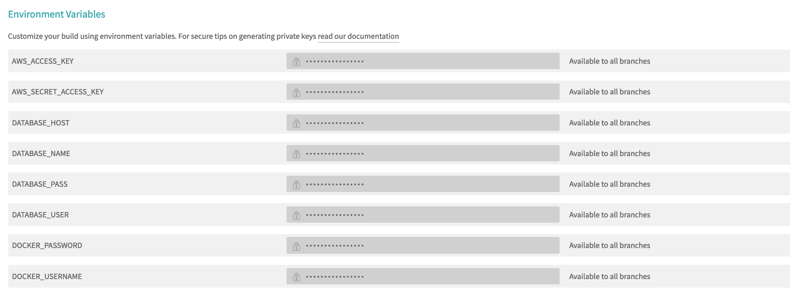

## 문제상황

GitHub -> Travis CI -> Docker 배포 잡을 달아둔 상황에 로컬에서 빌드된 도커랑 Travis에서 빌드된 도커랑 작동되는 상태가 달랐다. 실제로 각 이미지에서 `docker run -it` 로 `ls -al`을 해보니 리모트에서 받아온 도커 이미지에선 `.env`나 `ormconfig.json`과 같이 gitignore 된 항목들이 보이지 않고 있었다.

생각해보니 그럴만도 한 것이, Travis에서는 Git 기반으로 소스를 가져올 텐데, gitignore 처리된 것이 보일 수가 없었다.

이에 대해서 gitignore된 `.env` 혹은 config 파일을 Travis에서 다루기 위한 방법을 찾아보니, 보통쓰는 방법이 travis-cli의 `travis encrypt-file`을 이용하여 credential이 담긴 파일을 암호화하여 이를 `.travis.yml`에서 정의한 `before_install`등의 위치에서 복호화하는 방법이었다.

대략 아래와 같은 방법이다.

```bash
# secret.txt를 암호화하려고 한다.
$ travis login
$ travis encrypt-file secret.txt
encrypting secret.txt for stevejkang/travis-test
storing result as secret.txt.enc
storing secure env variables for decryption

Please add the following to your build script (before_install stage in your .travis.yml, for instance):

    openssl aes-256-cbc -K $encrypted_60e8b7beb8f6_key -iv $encrypted_60e8b7beb8f6_iv -in secret.txt.enc -out secret.txt -d

Pro Tip: You can add it automatically by running with --add.

Make sure to add secret.txt.enc to the git repository.
Make sure not to add secret.txt to the git repository.
Commit all changes to your .travis.yml.
# secret.txt.enc가 생성된다.
# secret.txt.enc 파일은 gitignore에 등록시켜야 한다고 한다.
# 추가로 .travis.yml의 before_install에 제공된 커맨드를 추가하라고 한다.
```

조금 더 괜찮은 접근법은 없는 걸까? 생각보다 Ops 단의 환경변수라던가 기타 설정(이를 테면, `$encrypted_60e8b7beb8f6_key` 따위)들이 코드단에 잔재로 남겨지는 것이 그렇게 좋아보이진 않았다.

## 고민

이미 이런 식으로 사용하고 있는 사례가 많을 지는 모르겠다. 이런 저런 삽질을 반복하다보니 `envsubst`라는 커맨드를 알게되었다.

이 커맨드는 **특정 텍스트를 환경변수에 정의한 값으로 대치하는 역할**을 하는데 정확한 커맨드 설명은 [여기](http://man.he.net/?topic=envsubst&section=all)를 참고해보자.

아래의 방법은 `envsubst` 커맨드와 약간의 트릭을 이용한 방법이다. 나름대로 기존 코드 베이스를 적게 해치면서 괜찮은 방법이라고 생각했다.

## 고쳐보자

나의 경우 모든 프로젝트에서는 `.env` 형태의 파일을 만들게 될 경우 `.env.example`이라는 환경변수의 스킴만 담아내는 파일을 만들어준다 `.env`의 스킴 변경사항까지 버전 관리를 하는 것이 맞다고 생각하기에 해당 파일은 git에 포함시켜준다.

반드시 `.env` 파일이 아니어도 괜찮다. 처음에 예시로 든 `ormconfig.json`도 `ormconfig.json.example` 등과 같이 스킴 파일을 따로 만들어서 관리할 수 있다.

보통 아래와 같다.

```
# .env.example
DB_HOST=$DB_HOST
```

travis.com에 들어가 해당 프로젝트 세팅에서 `DB_HOST` 키로 된 Envrionment Variable을 하나 만들어준다.



다시 돌아와 `.travis.yml`의 `before_install`에 아래 커맨드를 추가시킨다. (나의 경우 배포까지 진행되어 배포 전에만 작동하면 되었기에 `after_success`에 담아두었다.)

```
- cat .env.example | envsubst > .env
```

이러면 `.env.example`에 정의된 `$DB_HOST` 텍스트가 `cat`에 의해 shell로 prompt 되면서 envsubst을 만나 실제 환경변수로 덮어씌여진다. 이렇게 실제 환경변수가 된 `$DB_HOST` 텍스트는 `.env` 라는 새로운 파일이 만들어지면서 `DB_HOST=db.helloworld.com` 과 같이 저장되게 된다.

## 얻게된 효과

간단한 커맨드 하나 덕분에 배포시에만 `.env` 파일이 생성됨은 물론, 해당 스킴 파일만 만들어두었다면 `.gitignore`가 수정되지 않아도 되고, `$encrypted_60e8b7beb8f6_key` 따위의 내 의지와 상관없는 임의의 환경변수가 만들어지지도 않는다.
