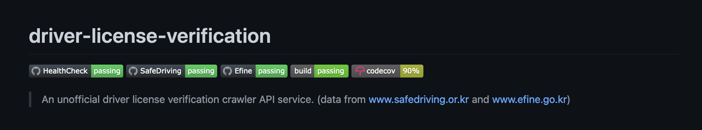

> 구현된 서비스 소스코드는 [여기 - stevejkang/driver-license-verification GitHub](https://github.com/stevejkang/driver-license-verification)에서 확인할 수 있습니다.

모빌리티 도메인의 플랫폼 서비스에서는 유저의 운전면허정보를 인증할 니즈가 있다. 당장 지금 다니는 회사에서도 렌트카 계약서를 작성할 때 운전면허 정보를 입력한다. PM의 한 종류인 킥보드도 같다. 대부분의 킥보드 서비스가 운전면허 검증을 요구한다. 운전면허의 사진을 찍어 OCR로 판별하는 경우도 있고, 면허 번호와 생년월일 등 단순 정보를 입력하는 경우도 있다.

하지만, 쏘카, 그린카와 달리 중개 플랫폼 서비스와 킥보드 서비스에서는 도로교통공사에서 제공하는 공식 API를 사용할 수 없다. 직접 자동차를 소유하고 있는 자동차대여사업자가 아닌 경우 해당 API의 사용은 거의 어렵다고 봐야한다. 관련해서 기사로 다룬 내용이 있어 짧막히 인용해본다.

> 업계에 따르면 운전면허 공공 데이터를 관리하는 도로교통공단은 공식적으로 두 가지 운전면허 진위여부 방식을 지원한다. 이 중 오픈 API를 통한 검증요청 방식은 많은 데이터를 빠르게 검증할 수 있다. 그러나 **공유킥보드 사업자는 이 방식을 사용할 수 없다. 해당 서비스가 현행 여객자동차운수사업법 상 자동차대여사업자(렌터카/카셰어링/대리운전)만을 대상으로 제공되기 때문이다.** 쏘카·그린카 등 카셰어링 서비스 역시 무인 대여 방식으로 운영되지만 무면허 운전 적발 사례 빈도가 상대적으로 적은 이유도 이 시스템 덕분이다.
> 
> **나머지 방법은 도로교통공단 통합민원 홈페이지에서 개인정보와 면허증 암호 일련번호를 입력하는 방식이다.** 누구나 이용할 수 있지만 사람이 하나하나 수기로 입력해야 한다. 면허증 하나를 확인하는 데만 몇분씩 소요된다. 이 때문에 신규 가입자가 몰리면 면허증 인증까지 길게는 2~3일이 걸린다.

나도 몰랐으나 주변에 킥보드 앱을 개발하는 지인들에게 물어봤을 때 다들 두번째 방법을 사용한다고 했다. 물론 기사처럼 면허증 번호 검증을 몇 분씩 소요되도록 수기로하는 업체는 없을 것 같다. (아, 수기로 검증정보와 면허증 사진의 크로스 체크가 필요할 순 있겠다.) 

대부분은 운전면허 검증을 해주는 사이트 몇군데에서 크롤링해서 정보를 가져오도록 구현한 내부 API를 만들어서 사용하고 있었다. 총 2개의 사이트를 찾을 수 있었는데, 하나는 안전운전 통합민원 사이트([safedriving.or.kr](https://www.safedriving.or.kr/), 이하 `SafeDriving`)와 나머지 하나는 경찰청 교통민원 24 - 이파인([efine.go.kr](https://www.efine.go.kr/), 이하 `Efine`)이다. 사실 내부적으로 관리하는 원천 데이터는 같겠지만, 서비스가 독립적이길래 두개 중에 한 개의 서비스에서 점검이나 장애가 나더라도 나머지 다른 한 곳의 기능을 이용하여 검증이 가능하도록 구현해보면 유용할 것 같다는 생각을 했다. (워낙 점검이 많은게 또 우리나라 정부 사이트라...)

그리하여 초기 목표는 한 서비스가 죽어도 검증이 가능한 API, 그리고 나머지 하나는 실시간 서비스 상태를 제공해주는 API였다. 사실 두가지 모두 기술적으로 대단한 노력이 필요한 구현이 아니다. 첫번째는 각 서비스별 검증을 `Promise`를 반환하도록 한 뒤, `Promise.any(iterable)` 를 쓰면 되고, 두번째는 [statuspage.io](http://statuspage.io/) 같은 third-party 서비스를 사용하거나, 직접 Health Check API를 만드는 것도 방법이다. 그래서 일단 이번 프로젝트에서는 첫번째 목표만 빠르게 달성해보려고 목표를 잡았다.

## 개발 스택
전체적인 백엔드 프레임워크는 `Nest.js`로 구성했고, 두 서비스(`SafeDriving`, `Efine`) 모두 검증 방식이 HTTP API 통신이 아닌 서버에서 결과를 그려주는 방식이라 DOM Parsing을 통한 결과 추출을 하기 위해 `JSDOM` 라이브러리를 사용했다. CI로는 GitHub Actions와 Travis를 사용했다. 사실 하나에서 CI/CD를 모두 처리해도 되지만, GitHub Actions를 실제 프로젝트에서 사용해보고 싶어서, E2E Test와 주요한 로직에 대한 Unit Test만 `GitHub Actions`에서 실행했고, 전체적인 Unit Test와 Coverage 체크를 위한 `Codecov`, `Docker` build는 `Travis`에서 진행했다. 따로 실제 서비스에 배포하는 로직은 추가하지 않았다. (나중에 시간이 나면 `Terraform`까지 적용해서 `AWS`에 배포하는 Flow까지 작성해볼 예정이다.)

이번에도 `Travis`에서 환경변수를 적용하기 위해서 `envsubst`을 사용해서 간결한 `.travis.yml` 파일을 작성했다. 관련한 블로그 글은 [여기 - Travis에서 조금 더 괜찮은 방법으로 환경변수 .env 다루기](https://juneyoung.io/devops-better-way-to-handle-env-in-travis-210308)를 참고하면 된다.

### 왜 `JSDOM`을 사용했는가? (`cheerio`나 `puppeter`를 사용하지 않은 이유)

- 일단 `cheerio`는 jQuery에 기반을 하고 있다. 물론 그중에서도 DOM API 구현에만 집중되어있지만, 개인적으로 jQuery를 선호하지 않기 때문에 사용하지 않았다.
    
- `puppeter`는 *headless browser*로 비동기를 매우 편하게 지원하긴 하나, 크롤링하려는 페이지가 단순 입력한 form을 담은 POST 요청에 따른 응답이 SSR된 페이지이기 때문에 굳이 headless browser를 사용할 필요가 없었다. (개인적으로 render까지 대기가 필요한 SPA에 적절하다고 생각한다)
    
- `jsdom`의 경우 프론트엔드 테스트에서 많이 쓰이기는 하나, Native DOM API를 지원한다는 점에서 DOM Parsing에는 효율적이라고 생각했다.
    
이 부분은 나중에 한번 더 자세하게 다뤄볼 예정이다.

## 주요 구현내용

구현한 소스코드는 깃허브에서 확인할 수 있다.

[https://github.com/stevejkang/driver-license-verification](https://github.com/stevejkang/driver-license-verification)

운전면허 검증에는 총 네가지 정보가 사용된다.

- 운전면허 번호
- 운전면허 일련번호
- 운전자명
- 운전자 생년월일

이 중에서 '운전면허 일련번호'는 공식 도로교통공단 API나 `SafeDriving`, `Efine`에서 제공하는 운전면허 검증 방식에서 필수값이 아니다. 따라서 API 요청상 optional 값으로 두고 만약 일 오면 좀 더 강한 검증을 하도록 개발했다. ([PR #8 - Support verification method without serialNumber](https://github.com/stevejkang/driver-license-verification/pull/8))

전체적인 서비스 자체는 Layered Architecture를 적용했고 각 계층간 Domain Object를 던지도록 했다. (사실 실제 SafeDriving과 Efine에 대한 내용은 Infrastructure에 있는 게 맞겠지만, 일단 Application 계층에 포함시켰다. 따라서 계층이 하나 없다.)

DriverLicense Domain은 Aggregate Root로, 각 Props들은 VO로 만들어 각각에 대한 테스트코드를 작성했다. 자세한 구현 내용은 Verification Module에 구현된 [/domain](https://github.com/stevejkang/driver-license-verification/tree/main/src/verification/domain) Directory를 참고하면 된다. 이를테면 아래와 같다.

```ts
// Driver Name Domain Object

interface DriverNameProps {
  value: string;
}

export const DRIVER_NAME_SHOULD_BE_DEFINED = 'Driver name should be defined';
export const DRIVER_NAME_LENGTH_SHOULD_BE_GREATER_THAN_OR_EQUAL_TO_TWO = 'Driver name length should be greater than or equal to 2';

export class DriverName extends ValueObject<DriverNameProps> {
  private constructor(props: DriverNameProps) {
    super(props);
  }

  static create(value: string): Result<DriverName> {
    if (typeof value === 'undefined') {
      return Result.fail(DRIVER_NAME_SHOULD_BE_DEFINED);
    }

    if (value.length < 2) {
      return Result.fail(DRIVER_NAME_LENGTH_SHOULD_BE_GREATER_THAN_OR_EQUAL_TO_TWO);
    }

    return Result.ok(new DriverName({ value }));
  }

  get value(): string {
    return this.props.value;
  }
}
```

위 VO를 가지는 DriverLicense Domain Object는 아래와 같다.

```ts
// Driver License Domain Object

interface DriverLicenseProps {
  driverName: DriverName;
  driverBirthday: DriverBirthday;
  licenseNumber: LicenseNumber;
  serialNumber: SerialNumber;
  verified?: boolean;
}

export class DriverLicense extends AggregateRoot<DriverLicenseProps> {
  private constructor(props: DriverLicenseProps, id: number) {
    super(props, id);
  }

  static create(props: DriverLicenseProps, id: number): Result<DriverLicense> {
    return Result.ok(new DriverLicense(props, id));
  }

  static createNew(props: DriverLicenseProps): Result<DriverLicense> {
    return this.create({ ...props }, 0);
  }

  get driverName(): DriverName {
    return this.props.driverName;
  }

  // 중략

  get verified(): boolean {
    return this.props.verified ?? false;
  }
}
```

그리고 실제 구현된 각 Vendor 별 UseCase는 CreateDriverLicenseVerificationUseCase에 모여 아래와 같은 방식으로 호출된다.

```ts
const verification = await Promise.any([Efine.retrieve(requestedDriverLicense.value), SafeDriving.retrieve(requestedDriverLicense.value)])
  .then((value: DriverLicense) => {
    return value.verified;
  })
  .catch((error) => {
    console.log(error);
    throw new Error('All verification methods have been an outage. This incident will be reported.');
  });
```

### API 상태를 확인하기 위한 뱃지

그리고 1일 단위로 GitHub Actions의 Scheduled Task를 이용하여 각 API의 서비스 유효성을 테스트하고 README에서 바로 확인이 가능하도록 Job을 만들었다. `.github/workflows/` 하위에 각각 `unitEfine.yml`, `unitSafeDriving.yml` 파일을 만들고 아래와 같이 workflow를 추가하였다.

```yml
name: Efine

on:
  push:
    branches:
      - main
  schedule:
    - cron: '0 15 * * *'

jobs:
  test-unit-efine:
    name: Test Efine

    runs-on: ubuntu-latest

    steps:
      - uses: actions/checkout@v2
      - name: Use Node.js
        uses: actions/setup-node@v1
        with:
          node-version: '16.x'
      - name: Install packages
        run: yarn
      - name: Create .env
        run: |
          touch .env
          echo TEST_DRIVER_NAME=${{ secrets.TEST_DRIVER_NAME }} >> .env
          echo TEST_DRIVER_BIRTHDAY=${{ secrets.TEST_DRIVER_BIRTHDAY }} >> .env
          echo TEST_LICENSE_NUMBER=${{ secrets.TEST_LICENSE_NUMBER }} >> .env
          echo TEST_SERIAL_NUMBER=${{ secrets.TEST_SERIAL_NUMBER }} >> .env
      - name: Run unit tests
        run: yarn test:unit:efine
```

그리고 각 API 별로 테스트를 하기 위한 NPM command도 `package.json`파일에 추가했다.

```json
"test:unit:efine": "jest ./src/verification/application/CreateDriverLicenseVerificationUseCase/api/Efine.spec.ts",
"test:unit:safedriving": "jest ./src/verification/application/CreateDriverLicenseVerificationUseCase/api/SafeDriving.spec.ts",
```

결과적으로 아래와 같이 전체적인 Health Check 결과와, 각 API 별 성공여부를 한눈에 확인할 수 있게 되었다. 하루에 한번씩 매 0시에 돌며, 전체 E2E 테스트와 각 API별 Unit Test를 실행한다.



### 운전면허 검증
결론적으로 아래와 같은 요청을 날렸을 때, 두 API(`SafeDriving`, `Efine`) 중 먼저 성공으로 응답하는 결과를 반환한다. 관련한 자세한 API 명세는 프로젝트 실행 후 `/docs` Path에서 Swagger 문서 형태로 확인할 수 있다.

```json
// POST /verification Request body (application/json)
{
  "driverName": "홍길동",
  "driverBirthday": "2001-12-08",
  "licenseNumber": "11-90-623000-00",
  "serialNumber": "XXXXXX"
}
```

```json
// POST /verification Response body (application/json)
{
  "isSuccess": true,
  "verificationResult": "VALID"
}
```

## 에피소드
사실 이 프로젝트를 개발하면서 가장 문제가 되었던 것은 웃프게도 내가 운전면허가 없어 테스트간 실제 검증이 어려웠던 점이 있다. 작년 중순에 면허시험을 필기까지 보고 그 다음단계로 못넘어가서 아직 면허가 없는 상태다. 당연히 검증할 면허번호가 없으니, 내가 제대로 맞게 개발했는지 알 수도 없는 법. 결국, 초반에는 일단 감으로 개발을 진행하다가, 정말 가까운 사람들의 운전면허를 빌려서 테스트를 진행하는 방법으로 해결했다.

(2022-08-03 추가) 드디어 운전면허를 발급받아, GitHub Actions의 Secret 등을 모두 내 개인 Credential로 바꿔두었다. 이제는 내가 직접 테스트를 돌려볼 수 있게 되었다.

## Reference
- [면허취소자도 버젓이 운행 가능... 공유킥보드 인증 시스템 취약점 곳곳에](https://m.etnews.com/20200421000228)
- [stevejkang/driver-license-verification GitHub Repository](https://github.com/stevejkang/driver-license-verification/)
